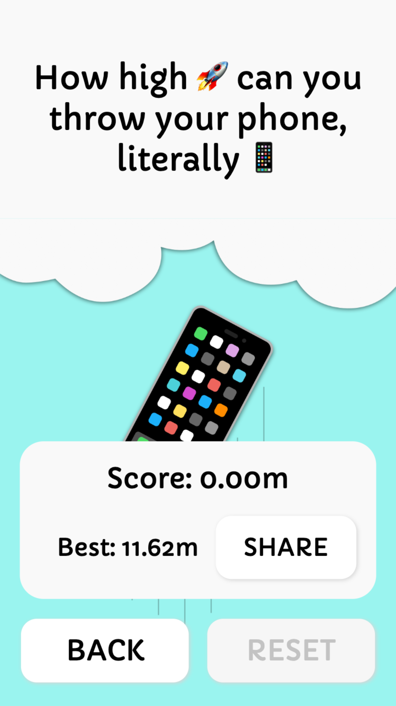

# PhoneFly 📱

📱 PhoneFly is an InstanFacebook game(https://developers.facebook.com/docs/games/instant-games/) where the objective is to throw your phone as high as you can 😮 It can be played at 👉🏼https://fb.gg/play/phonefly

👨‍👩‍👧‍👦 With over **75,000 unique users**, it leverages the Facebook platfor to make it very easy to compete and challange your friends to a phone throwing battle 🔥

## Screenshots




## Development

The local developement experience is not that straight forward since for the game to work, you need access to `FBInstant` that can only be fatched from Facebook like this: https://developers.facebook.com/docs/games/instant-games/test-publish-share

You also need to be logged in as a tester for the game to work.

To start the dev server run the dev command: `yarn dev`

The command will run three seperate commands:

```bash
yarn build # Builds the app into ./build

yarn dev:serve # Starts up an http-server serving ./build

yarn dev:open # Open the facebook url where you can test the app
```

NOTE: If you are running the `yarn dev` command for the first time, after you have run `yarn dev`, you need to visit `https://localhost:3000` and verify the ssl ceritificates. In Chrome for example you need to press proceed. After that, return to the url from the `yarn dev:open` command and refresh.

## Deploy

To deploy run the upload command: `yarn upload`, this will generate a `build.zip` that you have to then manualy upload to the Facebook Developer portal.
